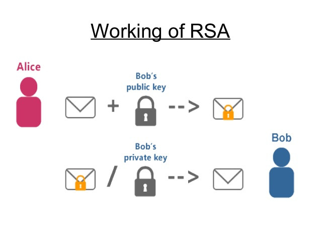

##Overview of RSA
- RSA (Rivest-Shamir-Adleman)
- Public-key cryptosystem
    - Encryption and decryption key are unique
- Asymmetric
    - Based on the difficulty of prime factorization

##Using RSA
- User creates a public and a private key

##Key generation

- 2 distinct prime numbers, p and q
- pq = n
    - n is the modulus for both keys
    - n's length is the key length (in bits)

